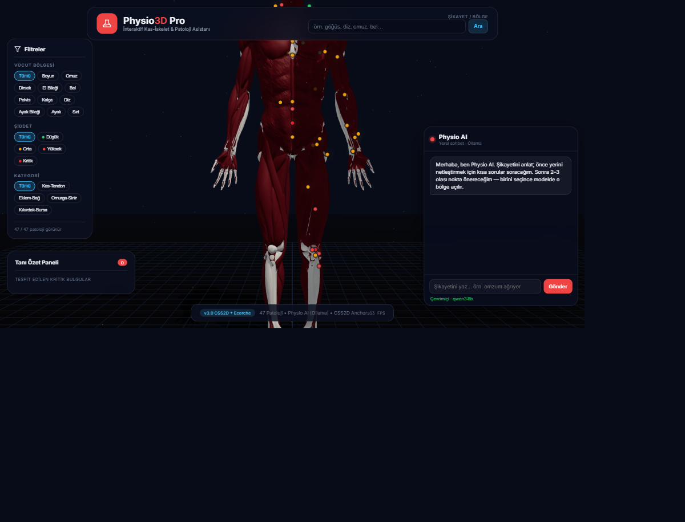
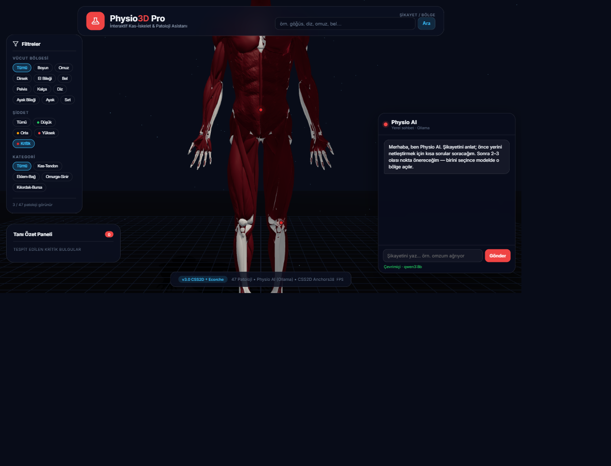
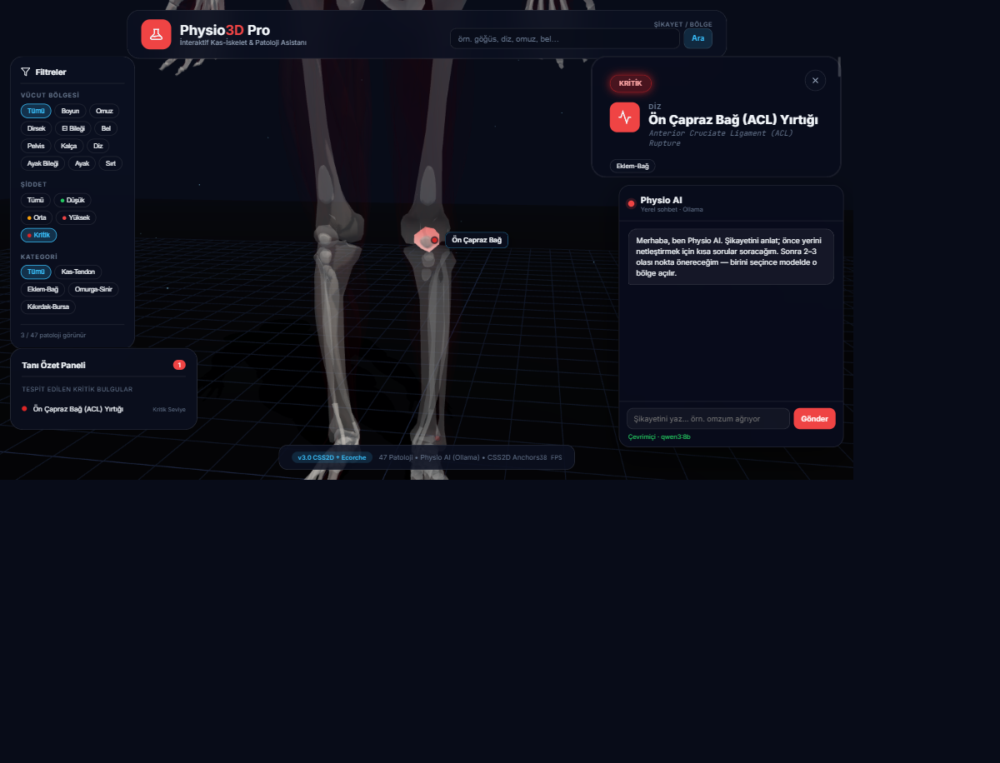

# Physio3D Pro

İnteraktif 3D kas-iskelet modeli üzerinde ortopedik / nörolojik patolojileri gösteren, yerel yapay zekâ ile semptomdan bölge öneren fizyoterapi eğitim ve erken uyarı prototipi.

**v3.0 · TÜBİTAK proje prototipi** · 47 patoloji · Physio AI (Ollama)

---

## Ekran görüntüleri

### Genel bakış
3D ecorché model, filtreler, tanı özeti ve sağ altta **Physio AI** sohbet paneli.



### Kritik patolojiler
Şiddet filtresinde **Kritik** seçildiğinde yalnızca acil uyarı gerektiren bulgular (ör. ACL, Aşil kopması, kauda equina) görünür.



### Patoloji detayı
Bir noktaya tıklayınca kamera odağı + x-ray görünüm ve bilgi paneli (semptomlar, uyarı, egzersiz ipucu).



---

## Ne işe yarar?

| Özellik | Açıklama |
|--------|----------|
| **3D anatomi** | Three.js ile kas-iskelet modeli; hotspot işaretçileri |
| **47 patoloji** | Boyun → ayak; şiddet (Düşük→Kritik) ve kategori filtreleri |
| **Arama** | Üst bardan şikayet / bölge metni |
| **Physio AI** | Yerel Ollama sohbeti: netleştir → 2–3 seçenek → modelde odak |
| **Kritik uyarı** | Acil değerlendirme gerektiren durumlar kırmızı işaretlenir |

> Klinik kesin teşhis aracı değildir; eğitim / demo / erken yönlendirme amaçlıdır.

---

## Hızlı başlangıç (Windows)

1. [Node.js](https://nodejs.org) kurulu olsun (LTS).
2. İlk kez: `kur.bat` — veya `npm install`
3. Çalıştır: `baslat.bat` — veya `npm run dev`
4. Tarayıcı: [http://127.0.0.1:3000](http://127.0.0.1:3000)

### Physio AI (isteğe bağlı)

Sohbet için bilgisayarda [Ollama](https://ollama.com) çalışıyor olmalı:

```bash
ollama pull qwen3:8b
ollama serve
```

Uygulama `/api/ollama` üzerinden `127.0.0.1:11434` adresine proxy eder (bulut API yok).

---

## Teknik özet

- **Stack:** Vite · Three.js · GSAP · CSS2D etiketler
- **AI:** Ollama (varsayılan `qwen3:8b`), bölgeye göre daraltılmış katalog
- **Veri:** `src/data/pathologies.js` + `src/pathology/AnatomyAnchors.js`
- **Kritik örnekler:** ACL yırtığı · Aşil tendonu tam kopması · Kauda equina

```
src/
  ai/           # PainAnalyzer — Ollama çağrıları
  data/         # patolojiler, AI katalog, promptlar
  pathology/    # hotspot, highlight, filtre
  scene/        # kamera, model, ışık
  ui/           # FizikoChat, paneller, arama
```

---

## Lisans / model

3D model atıfı: `public/models/ATTRIBUTION.txt`
